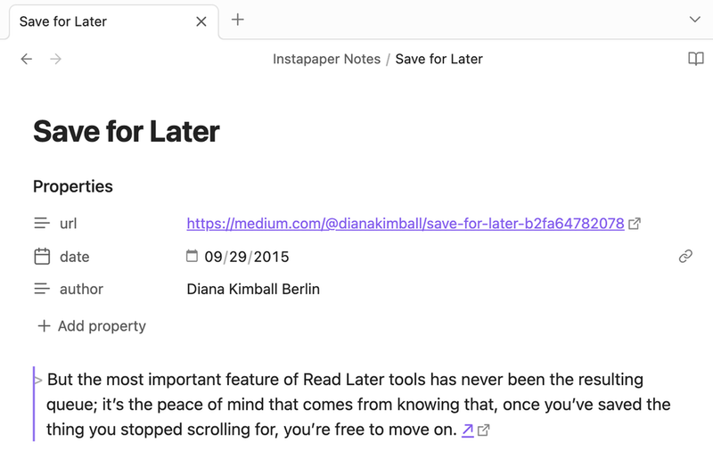

# Instapaper Plugin for Obsidian

This is the official Instapaper plugin for [Obsidian](https://obsidian.md),
a [2024 Obsidian Gem of the Year](https://obsidian.md/blog/2024-goty-winners/).

It integrates with your Instapaper account and allows you to:

- Save URLs from Obsidian notes to your Instapaper account
- Sync your highlights and notes to your Obsidian vault

## Setup

This plugin requires Obsidian v1.10.0 or higher.

1. Install the [Instapaper](https://obsidian.md/plugins?id=instapaper) plugin within Obsidian (**Settings → Community plugins**).
2. Enable the installed "Instapaper" plugin (**Settings → Community plugins → Installed plugins**).
3. Click the "Options" icon (or go to **Settings → Instapaper**) to connect your Instapaper account, start syncing highlights, and manage other options.

## Block Identifiers

Each synced highlight includes a [block identifier](https://help.obsidian.md/Linking+notes+and+files/Internal+links#Link+to+a+block+in+a+note) using the format `^h{highlight_id}`. This allows you to link to specific highlights from other notes using `[[Article Name#^h123456]]` and reference highlights in queries and searches.

## Tags

[Obsidian's tag format](https://help.obsidian.md/Editing+and+formatting/Tags#Tag+format) is more restrictive than Instapaper's so we apply some normalization rules:

- Obsidian tags cannot contain spaces. We replace runs of one or more spaces with a hyphen (`-`).
- Obsidian tags must contain a least one non-numeric character. We append an underscore (`_`) to any entirely numeric Instapaper tag.

## Feedback

Please send general feedback to: <support@help.instapaper.com>

[Code contributions](CONTRIBUTING.md) for improvements are also welcome.

## License

This project is made available under the terms of the [MIT License](LICENSE).
